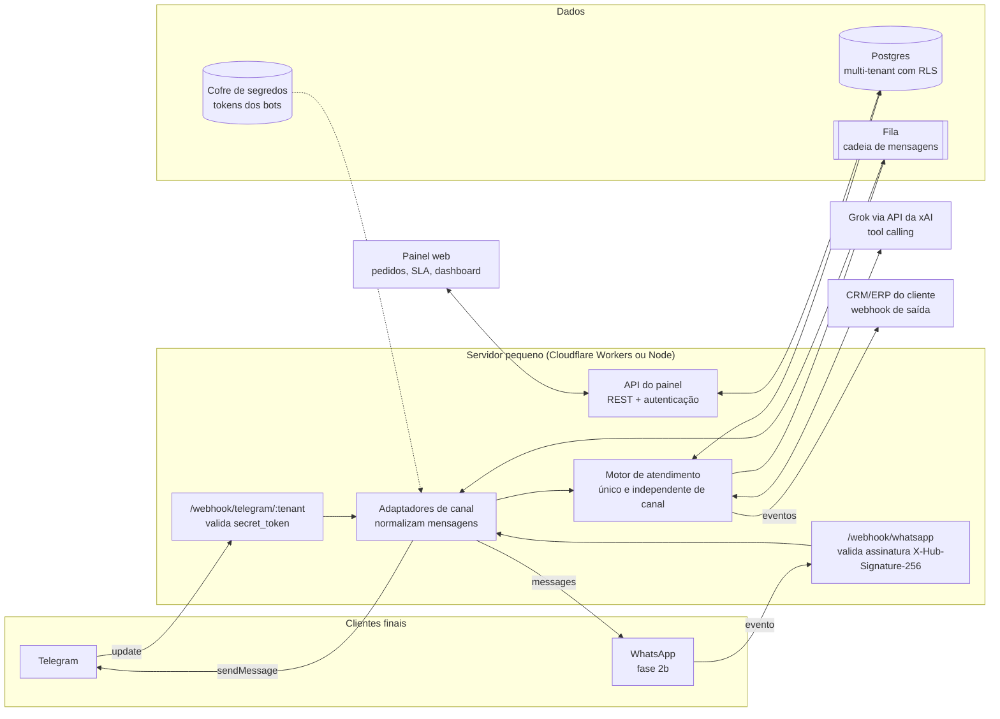

# Atende AI — arquitetura proposta para a fase 2

> **Status:** proposta, ainda não construída. A demonstração publicada (fase 1) é 100% estática: a "IA" é simulada por regras e palavras-chave em `dados.json` e não há conexão com o Telegram, o WhatsApp ou modelos de IA.

## 0. Onde estamos hoje

- **Fase 1 (publicada):** demonstração estática no GitHub Pages, IA simulada por regras.
- **Fase 1.5 (teste):** bot real [@Applojas10_bot](https://t.me/Applojas10_bot) em `bot/`, Python sem dependências, *long polling* (sem URL pública), mesmo `dados.json` e as mesmas regras portadas para `bot/motor.py`. Uma API somente leitura (`/api/export`, `/api/pedidos`, `/api/kpis`, `/api/catalogo`, com chave por negócio) é exposta por túnel rápido do Cloudflare e alimenta o "Modo conectado" do painel. Roda num computador de teste: não é produção.

## 1. Objetivo

Transformar a demonstração num produto multiempresa (SaaS) em que oficinas e lojas tenham:

- um **bot no Telegram** (canal principal) que atende o cliente final, entende o problema, monta o orçamento a partir do catálogo, combina prazo/SLA e abre o pedido;
- a **cadeia de mensagens automáticas** (confirmação, lembrete, pronto, pós-venda/NPS);
- um **painel** (pedidos, SLA, dashboard, configurações) igual ao da demonstração, agora com dados reais;
- depois, o **WhatsApp** como segundo canal, usando o mesmo motor.

## 2. Decisão de canal: Telegram primeiro, WhatsApp depois

| | Telegram Bot API | WhatsApp Cloud API (Meta) |
|---|---|---|
| Custo da API | Gratuita | Cobrança por conversa/modelo de mensagem, conforme a tabela da Meta |
| Aprovação | Nenhuma: cria-se o bot no @BotFather e recebe-se um token | Conta comercial verificada, número dedicado e modelos de mensagem aprovados |
| Botões | Inline keyboard (vários botões, `callback_data`) e reply keyboard | Até 3 reply buttons ou 1 lista por mensagem interativa |
| Mensagens proativas | Livres depois que o cliente inicia a conversa com o bot | Fora da janela de 24h, só com modelo aprovado |
| Alcance no Brasil | Menor que o WhatsApp | Canal dominante |

**Conclusão:** o Telegram valida o produto rápido e sem custo de API. O WhatsApp entra como segundo adaptador quando houver clientes pagantes que justifiquem a verificação e o custo por conversa.

## 3. Visão geral



## 4. Componentes

### 4.1 Adaptadores de canal (`js/canais/` na demonstração → `adapters/` no servidor)

A demonstração já separa o **motor** (`js/motor.js`, `js/conversa.js`) dos **adaptadores** (`js/canais/telegram.js`, `js/canais/whatsapp.js`). O motor só conhece uma mensagem neutra:

```json
{ "de": "cliente", "texto": "barulho ao frear", "teclado": [{ "rotulo": "✅ Aprovar", "valor": "aprovar" }] }
```

No servidor, cada adaptador faz duas traduções:

- **entrada:** `update` do Telegram (`message.text` ou `callback_query.data`) → mensagem neutra;
- **saída:** mensagem neutra → `sendMessage` com `reply_markup.inline_keyboard` (Telegram) ou mensagem interativa com até 3 botões (WhatsApp).

**Telegram (fase 2a)**

1. O dono cria o bot no @BotFather e cola o token no painel. O token vai direto para o cofre de segredos do servidor.
2. O servidor chama `setWebhook` com a URL `https://api.<dominio>/webhook/telegram/<tenant>` e um `secret_token` aleatório.
3. Cada `update` recebido é validado pelo cabeçalho `X-Telegram-Bot-Api-Secret-Token`, deduplicado por `update_id` e respondido com HTTP 200 rápido. O processamento pesado vai para a fila.
4. Botões usam `callback_data` curto (até 64 bytes), ex.: `aprovar:OF-2001`, `slot:1696700000`.

> **Regra inegociável:** o token do bot **nunca** fica no navegador, no repositório ou no front-end. Quem tem o token controla o bot. Ele vive só no cofre do servidor (ex.: Cloudflare Secrets ou variável de ambiente cifrada) e é trocado no @BotFather se vazar.

**WhatsApp (fase 2b)**

- WhatsApp Cloud API da Meta, com webhook validado por `X-Hub-Signature-256`.
- Modelos de mensagem aprovados para as automações que saem fora da janela de 24h (lembrete, pós-venda).
- O adaptador corta os botões em 3 e troca listas longas por mensagem de lista.

### 4.2 Motor de atendimento com LLM (Grok via API da xAI)

O motor substitui as regras da demonstração por um LLM com **tool calling**. O modelo não inventa preço nem prazo: ele chama ferramentas que consultam o banco.

| Ferramenta | O que faz |
|---|---|
| `buscar_catalogo(texto)` | Retorna serviços/produtos do tenant que combinam com o relato |
| `gerar_orcamento(servicos, veiculo)` | Calcula faixas de peças/produtos e mão de obra/entrega a partir do catálogo e dos ajustes |
| `calcular_prazo(prioridade, duracao)` | Aplica o SLA em horas úteis e o horário de funcionamento |
| `criar_pedido(dados)` / `atualizar_pedido(id, campos)` | Grava o pedido e a conversa |
| `agendar(id, horario)` | Reserva o horário e agenda o lembrete |
| `chamar_atendente(id, motivo)` | Marca o pedido para atendimento humano e notifica a equipe |

Proteções:

- **prompt de sistema por tenant** com tom, regras e limites (ex.: nunca prometer diagnóstico definitivo);
- **validação do resultado das ferramentas** no servidor: o valor que vai ao cliente vem sempre da função, nunca do texto do modelo;
- **plano B por regras** (o motor atual da demonstração) quando a API da xAI falhar ou passar do orçamento de custo;
- limite de turnos e de tokens por conversa, e aviso claro de que é um assistente automático.

### 4.3 Cadeia de mensagens (fila)

- Cada mudança de status gera eventos (`confirmacao`, `lembrete`, `andamento`, `pronto`, `posvenda`) com horário de envio.
- Uma fila (Cloudflare Queues, ou BullMQ/Redis no Node) entrega no horário, com nova tentativa e backoff.
- Respeita o horário de funcionamento e o "não perturbe" do cliente (opt-out com `/parar`).

### 4.4 Backend multi-tenant

- **Opção A (enxuta):** Cloudflare Workers + Queues + banco Postgres gerenciado (ex.: Neon ou Supabase) via conexão com pool.
- **Opção B:** Node.js (Fastify) num contêiner pequeno + Postgres + Redis.
- Toda tabela tem `tenant_id`. O Postgres aplica **Row Level Security** para que uma empresa nunca leia dados de outra.
- Tabelas principais: `tenants`, `usuarios`, `canais` (referência ao segredo, nunca o token em claro), `catalogo`, `clientes`, `pedidos`, `mensagens`, `eventos_automacao`, `regras_automacao`, `sla`.

### 4.5 Autenticação no painel

- Login por e-mail com link mágico ou senha + 2FA opcional; sessões em cookie `HttpOnly`, `Secure`, `SameSite=Lax`.
- Papéis: **dono** (tudo), **atendente** (pedidos e conversas), **leitura** (dashboard).
- Registro de auditoria de quem mudou preço, regra ou status.

### 4.6 Plugin/integração com CRM

- **Webhook de saída** por tenant (`pedido.criado`, `pedido.aprovado`, `pedido.entregue`, `nps.recebido`), assinado com HMAC.
- **API REST** com chave por tenant para ler/gravar pedidos e catálogo.
- **Widget embutível** (`<script>` de uma linha) para o site do cliente, abrindo a mesma conversa do motor.
- Conectores prontos numa fase 3 (ex.: planilha, RD Station, Pipedrive, ERPs de oficina).

## 5. LGPD

- **Base legal:** execução de contrato/procedimentos preliminares (orçamento e serviço) e legítimo interesse para lembretes; consentimento para pesquisas e marketing.
- **Papéis:** a oficina/loja é **controladora**; o Atende AI é **operador**. Contrato de processamento de dados (DPA) com cada cliente.
- **Minimização:** guardar só o necessário (nome, contato no canal, veículo/placa, endereço de entrega). Nada de documentos pessoais.
- **Transparência:** primeira mensagem do bot informa que é um atendimento automático e aponta a política de privacidade.
- **Direitos do titular:** comando `/meusdados` e pedido de exclusão pelo painel; exclusão em até 15 dias.
- **Retenção:** conversas por 12 meses (configurável), depois anonimização para estatística.
- **Envio ao LLM:** mandar ao modelo só o necessário para responder, sem telefone; verificar os termos de uso e retenção de dados da xAI antes de produção.
- **Segurança:** TLS em tudo, cifragem em repouso, segredos em cofre, backups diários, registro de incidentes e comunicação à ANPD quando aplicável.

## 6. Ideia de planos

| Plano | Para quem | Inclui | Preço de referência* |
|---|---|---|---|
| Essencial | Oficina/loja pequena | 1 bot Telegram, até 300 conversas/mês, motor por regras, painel | R$ 79/mês |
| Profissional | Negócio em crescimento | IA (Grok) com tool calling, até 1.000 conversas, automações completas, 3 usuários | R$ 199/mês |
| Rede | Várias unidades | Multiunidade, WhatsApp (quando disponível, custo da Meta repassado), API/webhooks, SSO | sob consulta |

\* Valores ilustrativos para validação com clientes; precisam de pesquisa de mercado.

## 7. Custos estimados de operação (ordem de grandeza)

| Item | Estimativa inicial |
|---|---|
| Telegram Bot API | R$ 0 |
| Servidor (Workers/contêiner pequeno) | R$ 0 a R$ 50/mês no início |
| Postgres gerenciado | R$ 0 a R$ 130/mês |
| LLM (Grok/xAI) | variável por token; calcular com conversas reais e limitar por tenant |
| WhatsApp Cloud API (fase 2b) | por conversa, conforme tabela vigente da Meta |
| Domínio, e-mail, monitoramento | R$ 30 a R$ 100/mês |

Os números precisam ser validados com preços atuais dos fornecedores antes de fechar os planos.

## 8. Riscos e mitigação

| Risco | Mitigação |
|---|---|
| Cliente final não usa Telegram | Começar com segmentos/cidades onde já usam; QR code e link `t.me/<bot>` no balcão; WhatsApp como fase 2b |
| LLM errar preço ou prometer o que não pode | Preço e prazo só via ferramentas; validação no servidor; texto "valores estimados" |
| Vazamento do token do bot | Token só no cofre do servidor, `secret_token` no webhook, rotação no @BotFather |
| Custo de IA sair do controle | Limites por tenant, cache de respostas frequentes, plano B por regras |
| Mistura de dados entre empresas | `tenant_id` + Row Level Security + testes automatizados de isolamento |
| Mudança de regras/preços da Meta | Adaptador isolado; produto não depende do WhatsApp para funcionar |
| LGPD | DPA, minimização, retenção configurável, canal de direitos do titular |

## 9. Roteiro sugerido

1. **Fase 2a (4–6 semanas):** servidor + webhook do Telegram + Postgres + painel conectado; motor por regras (o da demonstração) em produção com 2–3 oficinas piloto.
2. **Fase 2a+:** troca do motor por Grok com tool calling, mantendo o plano B por regras; métricas de acerto do orçamento.
3. **Fase 2b:** adaptador WhatsApp Cloud API, modelos aprovados, cobrança por plano.
4. **Fase 3:** widget para site, webhooks/API para CRM e conectores.
